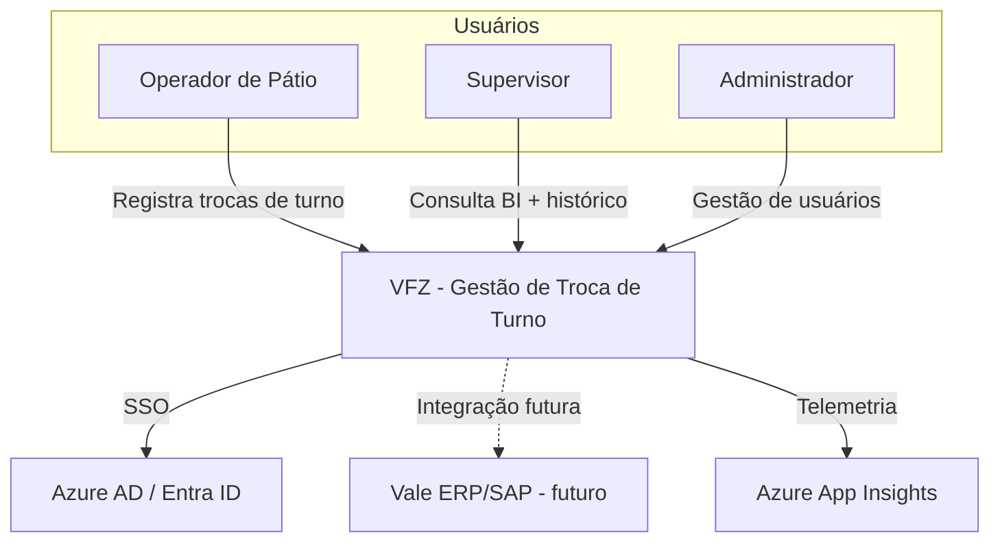
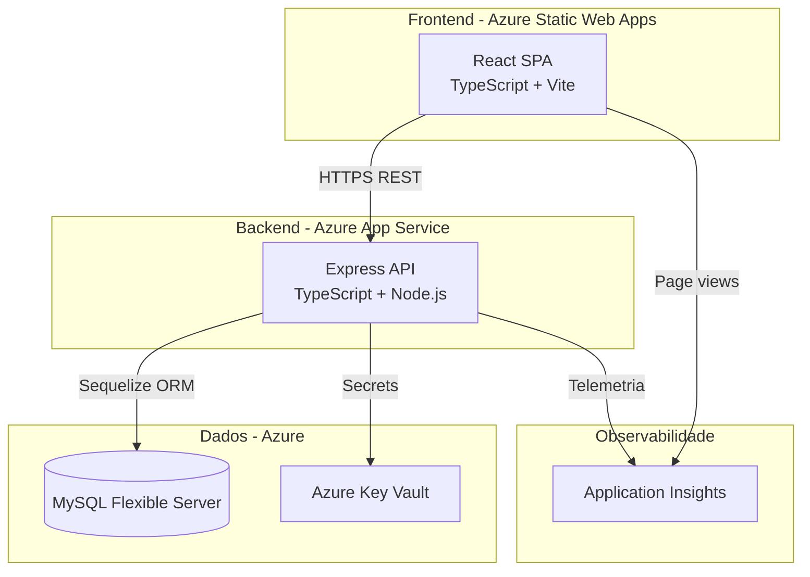
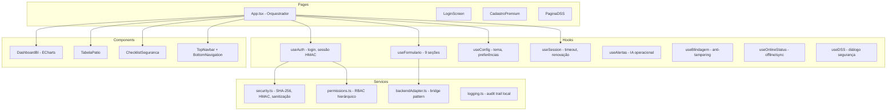
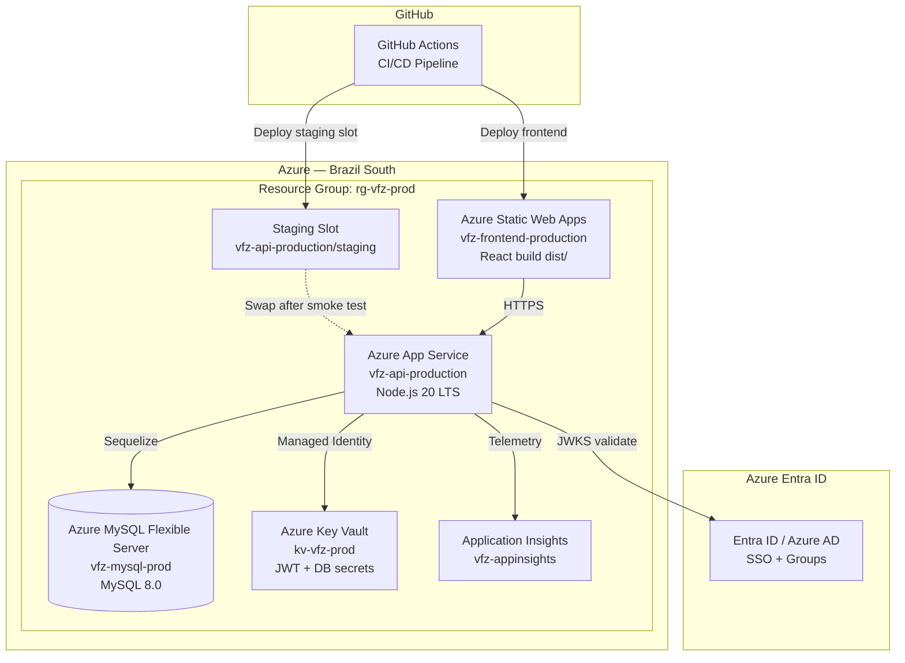
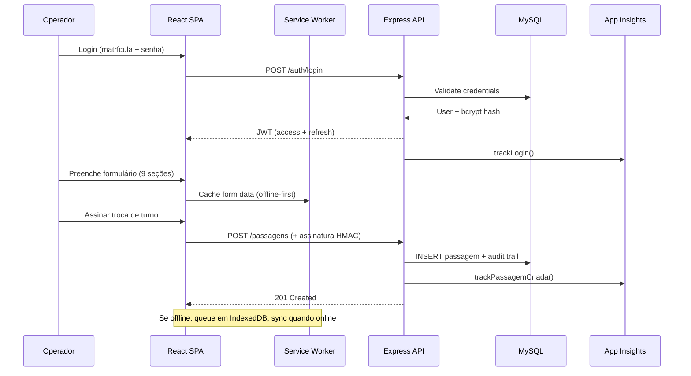

# VFZ — Documentação de Arquitetura (Modelo C4)

## Diagrama 1: Context



## Diagrama 2: Container



## Diagrama 3: Component — Backend

```mermaid
graph TB
  subgraph "Routes"
    R1[/auth/*]
    R2[/passagens/*]
    R3[/audit/*]
    R4[/usuarios/*]
    R5[/lgpd/*]
  end
  subgraph "Middleware"
    M1[authenticate]
    M2[authorize]
    M3[security - rate limit, CORS, helmet]
    M4[azureAuth - SSO]
  end
  subgraph "Controllers"
    C1[authController]
    C2[passagensController]
    C3[auditController]
    C4[usersController]
    C5[lgpdController]
  end
  subgraph "Services"
    S1[authService - bcrypt, JWT, refresh rotation]
    S2[auditService - append-only chain]
  end
  subgraph "Models - Sequelize"
    MO1[Usuario]
    MO2[Passagem]
    MO3[AuditTrail]
  end

  R1 --> M3 --> M1 --> C1 --> S1
  R2 --> M1 --> M2 --> C2
  R3 --> M1 --> M2 --> C3 --> S2
  C1 --> MO1
  C2 --> MO2
  S2 --> MO3
```

## Diagrama 4: Component — Frontend



## Diagrama 5: Deployment



## Diagrama 6: Data Flow — Gestão de Troca de Turno



## Decisões Arquiteturais (ADRs)

| # | Decisão | Motivo |
|---|---------|--------|
| ADR-001 | Monorepo (vfz + backend) | Equipe pequena, deploy coordenado |
| ADR-002 | MySQL (não PostgreSQL) | Compatibilidade com stack Vale |
| ADR-003 | JWT + Refresh Token rotation | Sessões 8h sem reautenticação |
| ADR-004 | Dual Auth (Azure AD + local) | SSO corporativo + fallback offline |
| ADR-005 | HMAC em assinaturas | Integridade da troca de turno sem PKI |
| ADR-006 | Audit trail append-only com hash chain | Evidência forense imutável |
| ADR-007 | React SPA (não SSR) | Operação offline-first |
| ADR-008 | Blue/Green deploy com slot swap | Zero downtime em produção |
| ADR-009 | Service Worker cache-first | Resiliência operacional 24/7 |

## NFRs (Non-Functional Requirements)

| Requisito | Target | Medição |
|-----------|--------|---------|
| Disponibilidade | 99.5% | Azure SLA composite |
| Latência API p95 | < 1s | App Insights |
| Latência API p99 | < 2s | App Insights |
| Login burst (20 concurrent) | p95 < 500ms | k6 login-burst |
| Recovery Time (RTO) | < 30 min | Runbook |
| Recovery Point (RPO) | < 1h | MySQL PITR |
| Concurrent users | 40+ | k6 shift-change |
| Bundle size | < 15MB | CI check |
